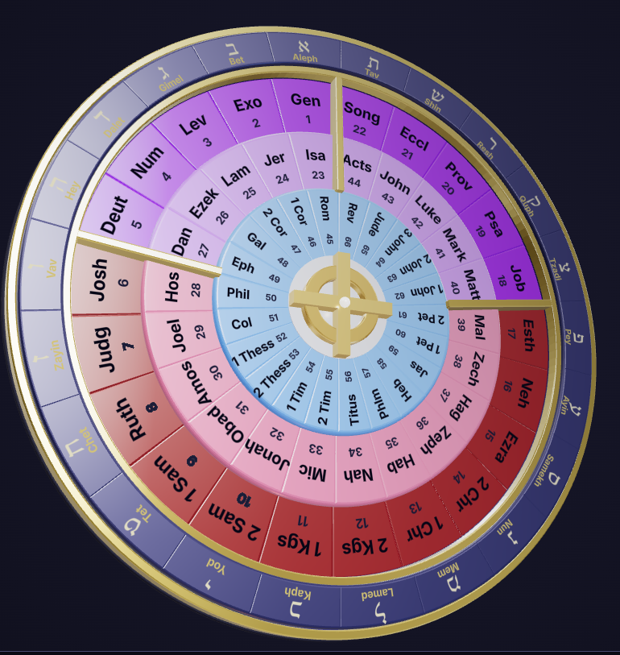

# Bible Wheel — React + Three.js

[](https://react.dev/)
[](https://www.typescriptlang.org/)
[](https://vitejs.dev/)
[](https://threejs.org/)
[](https://github.com/protectwise/troika/tree/master/packages/troika-three-text)

**A pixel-perfect, interactive 3D recreation of the classic Bible Wheel (Canon Wheel) visualization.**

The Bible Wheel displays the 66 books of the Bible as three concentric cycles arranged around 22 spokes that correspond to the 22 letters of the Hebrew alphabet. Each wheel is called a cycle and contains 22 books. The three cycles subdivide into seven divisions, which when colored create the Canon Wheel:

- **CYCLE 1** — Genesis to Song of Solomon
  - **Torah (5)** 
  - **OT History (12)** 
  - **Wisdom (5)**  

- **CYCLE 2** — Isaiah to Acts
  - **Major Prophets (5)** 
  - **Minor Prophets (12)**  
  - **NT History (5)**

- **CYCLE 3** — Romans to Revelation
  - **NT Epistles (22)** 



Explore the original vision: [biblewheel.com/original](https://biblewheel.com/original)


## Features

- **Artistic Representation** — 3 concentric cycles (66 books), gold rings, beveled cells, Celtic cross with emissive pulse
- **Canon / Division Block Mode** (▣ toggle) — 7 continuous colored arcs with smooth cross-fade and z-fighting mitigation
- **High-quality curved typography** — Per-character Troika SDF text with correct orientation (`reverseFor` / `flipRotationFor` maps) for every division
- **Rich hover interactions**
  - Normal mode: Book wedges lift + emissive boost; Hebrew alphabet spokes highlight and lift their wedges
  - Canon mode: Large division blocks lift with their labels
- **Cinematic entrance animation** — Camera dolly + spin + subtle rock that settles into a clean static view with OrbitControls
- **Full artistic control panel** (⚙ gear)
  - Per-division color, font choice, size, angular spacing, and center offset
  - Live updates (no full rebuilds)
  - Export / Import all settings as JSON (round-trips perfectly via localStorage)
- **Professional PBR rendering** — MeshPhysicalMaterial with clearcoat, environment mapping (RoomEnvironment), ACES Filmic tone mapping
- **Dev lighting studio** — "View & Lighting" panel (dev mode) with sliders for key/fill/rim lights, ambient/env intensity, and 3D light position helpers
- **Settings persistence** — Everything is saved automatically and survives hard refreshes

## Tech Stack

| Layer                  | Technology                                      | Role |
|------------------------|--------------------------------------------------|------|
| **Framework**          | React 19 + TypeScript ~5.8                      | UI + component model |
| **Build Tool**         | Vite 6                                          | Lightning-fast dev server + optimized production builds |
| **3D Engine**          | three.js 0.184                                  | Core WebGL renderer, geometries, materials, lights |
| **React 3D Renderer**  | @react-three/fiber 9                            | Declarative JSX for Three.js scenes |
| **R3F Helpers**        | @react-three/drei 10                            | OrbitControls, environment helpers |
| **Text Rendering**     | troika-three-text 0.52                          | High-quality SDF text with per-character curved placement |
| **UI Icons**           | lucide-react                                    | Clean icon set |
| **Styling**            | Plain CSS + CSS custom properties               | Minimal, focused presentation |
| **State & Persistence**| React hooks + Context + localStorage + JSON     | Zero external state libraries |
| **Geometry**           | Custom `ExtrudeGeometry` + bevels (wheelGeometry.ts) | All rings, wedges, and dividers |

### Architecture Highlights

The project was aggressively refactored into a clean, maintainable system:

- **5 focused custom hooks** (barrel-exported from `hooks/index.ts`):
  - `useBibleWheelSettings` — All color, label style, and display settings with full import/export/reset
  - `useDebugLighting` + `DebugLightingProvider` — Complete lighting state + imperative light updates via Context
  - `useHebrewRing` — Hebrew alphabet cells + spoke-hover lifting
  - `useDivisionTransition` — Canon block creation + smooth cross-fade
  - `useWheelInteraction` — Raycaster-based picking + mode-aware hover/lift
  - `useWheelAnimation` — Entrance sequence + idle pulse + opacity transitions

- **Thin orchestrator**: `BibleWheel.tsx` is now ~160 lines and only composes UI + wires the hooks.
- **Pure utilities**: All geometry and label creation logic lives in `utils/`.
- **Typed userData**: `WedgeUserData`, `DivisionBlockUserData`, `LabelledMeshUserData` etc. for safe hover lifting of meshes + labels together.

This structure makes the component easy to embed in larger experiences (future "Biblical Worlds" project).

## Getting Started

```bash
cd biblewheel-react
npm install
npm run dev
```

Open http://localhost:5173

### Production Build

```bash
npm run build
npm run preview
```

## Controls & Interaction

- **Click** a book wedge → shows book info panel
- **Hover** any wedge or Hebrew cell → lifts it + boosts emissive
- **▣ button** → toggles Canon / Division Block mode (beautiful 7-arc view)
- **⚙ gear** → opens the full style panel (colors + per-division curved label tuning)
- **Export / Import** buttons in the style panel → share or backup artistic settings
- **Dev only**: Open the "View & Lighting" tab (when `import.meta.env.MODE === 'development'`) for complete control over the three-point lighting rig and environment intensity

## Comparison with the Original Angular Version

The original Angular implementation lives in the sibling folder `../biblewheel`.

Convenience scripts are provided so you can run both versions side-by-side:

```bash
# Terminal 1
npm run serve:angular:open     # Angular on :4200

# Terminal 2
npm run dev                    # React + Vite on :5173
```

This workflow was used extensively to achieve visual and behavioral parity.

## Project Structure

```
biblewheel-react/
├── public/assets/fonts/          # 9 custom TTFs (Inter, Bebas Neue, Anton, etc. + Hebrew)
├── src/
│   ├── features/bible-wheel/
│   │   ├── BibleWheel.tsx           # Thin orchestrator + UI panels
│   │   ├── BibleWheelScene.tsx      # Main 3D scene + hook composition
│   │   ├── bible-wheel.types.ts     # Config, DIVISIONS, font maps, userData interfaces
│   │   ├── bible-data.ts            # 66-book data
│   │   ├── components/              # ColorPickerPanel, LightingDebugControls, etc.
│   │   ├── hooks/                   # 5 core hooks + barrel (see Architecture above)
│   │   └── utils/                   # Pure geometry & label creation
│   ├── App.tsx
│   ├── main.tsx
│   └── styles.css
├── package.json
└── vite.config.ts
```

## Persistence & Settings

All artistic decisions (division colors, per-division label styles, custom display names) are:

- Saved automatically to `localStorage`
- Exportable as a single JSON file
- Importable (drag any previously exported file)

The system is deliberately designed so an artist can fine-tune everything visually and then hand the resulting JSON to a developer for permanent inclusion.

## Future Vision

This component is the foundation for a larger "Biblical Worlds mindmap" experience that may eventually include:

- Isaiah-Bible correlation views
- Gematria / holograph visualizations
- Deeper navigation between related passages

The clean `features/bible-wheel/` boundary makes extraction into a larger Three.js application straightforward.

## Credits

- Original concept & implementation: The Bible Wheel project (biblewheel.com)

**Port completed:** 2026  


---

*For deep technical notes on the Canon Division system and live label tuning, see [HANDOFF.md](./HANDOFF.md).*
